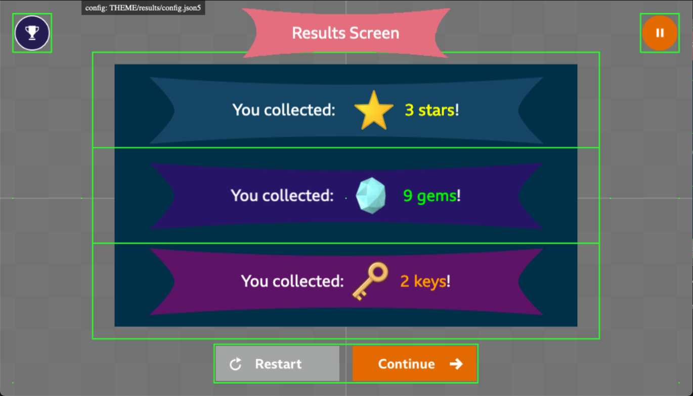
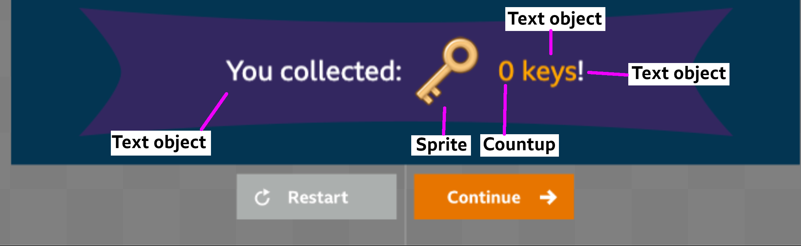
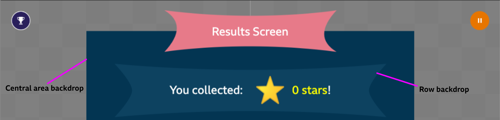

# Results Screen

## Rows

The results section of the results screen is split up into rows, defined in the theme config for the screen.  

Each row is given equal height, and objects inserted into rows are centered within each row by default.  

The content in the rows can be offset, for example, in the screenshot below, each text object has a `y` offset applied - which moves the text closer to the top or bottom of the row and the centre of the safe area.



You should keep to the recommended maximum of 3 rows, this is to ensure content is clearly visible on all devices. If you wish, you may have less than 3 rows.

The title for the screen is defined in config as per other screens, e.g: 

```json5
{
    theme: {
        results: {
            title: {
                text: "Results Screen",
                style: {
                    fontSize: "24px", 
                    color: "#FFFFFF",
                },
                backgroundKey: "results.title-backdrop",
            }
        }
    }
}
```

Title can be a Phaser BitmapText object by setting `type` to "bitmaptext" and supplying a `bitmapFont` asset key along with a `size`, e.g: 

```json5
{
...
    title: {
        text: "Results Screen",
        type: "bitmaptext",
        size: 30,
        bitmapFont: "examples_uiFont",
        backgroundKey: "results.title-backdrop",
    }
...
}
```

## Examples

### Results Object Types



In the screenshot above, the row has been built using the following results objects:
- A text object containing the white text: "You collected:"
- A sprite object containing an image of  a key.
- A countup object which starts at 0 and counts up to the players key score.
- A text object containing the text: "key" or "keys" depending on whether the score is 1 or not.
- A text object containing the white text "!".

You may use a mixture of these objects to create each row of the results screen.  
By default, they will position and center themselves in the middle of their row. However, you may apply x and y offsets to each item in the row, if you choose to.

### Backdrops



You may add a central area backdrop by providing the correct image asset key, you can also set an alpha on this image.

Optionally, you can also add a backdrop to each row, this does not have to be the same image for each row.

## Example Config

Each row is defined in the array of rows, and the central area backdrop is defined as a backdrop object in the results config file.

**Results config file:**
```json5
{
    theme: {
        results: {
            backdrop: { // this is the central area backdrop
                key: 'results.backdrop',
                alpha: 1,
            }
            rows: [Row object] // each row is defined in here
        }
    }
}
```

Within each row object, there is a format array, this is an array of text/sprite/countup objects that make up that row.

You may also add an optional backdrop object, set an alpha on the whole row, add a phaser tween transition for the row or add audio to be played.

**Row object:**
```json5
{
    format: [ResultsText/Sprite/Countup object],
    backdrop: { //optional row backdrop
        key: 'results.row-backdrop-1',
        offsetY: -20,
        offsetX: 0
    },
    alpha: 1, //optional
    transition: {}, // optional phaser tween config object here,
    audio: { key: 'results.woosh', delay: 0 }, // optional audio
}
```

To learn more on how to configure the objects in the format array, see the "Results Object Types" documentation below.

## Results Object Types

* [Text](./results-text.md)
* [BitmapText](./results-bitmaptext.md)
* [Sprite](./results-sprite.md)
* [Countup](./results-countup.md)

## Row Transitions and Audio

* [Row Transitions](./results-transitions.md)
* [Row Audio](./results-audio.md)

## Row Particles

* [Row Particles](./results-particles.md)

## 'Restart' button for a complete game

When a game is determined to be in a complete state, the restart button should be replaced with a 'Play again' button.
This is done by setting the data in your game component:  
 
`this.transientData.results.gameComplete = true;`

The user can be sent to the appropriate screen for a complete game using the routes API.

## Frequently Asked Questions

#### How do I make all of the rows transition in at the same time?  
You can set all of the delays on the Phaser Tween configuration object to be the same. Then each row will transition in at the same time. All delays are from when the screen is created.

#### How do I create Pass and Fail states for my Results Screen?  
Create two results screens and add these to the game flow in `main.js`. Then all you need to do is have your game navigate the user to either the pass or the fail screen.

#### Can I use more than 3 rows for my Results Screen?
It is not recommended to use more than 3 rows in the results screen, due to the fact text sizes would need to be made smaller and this may have an impact on readibility on smaller sized devices.

#### Do I need to change the offsets on each Results row object to position them?
Nope, by default, each object will be put alongside the previous object. If you require more space between objects, or wish to position them a bit differently, set x and y offsets on each of the objects appropriately.